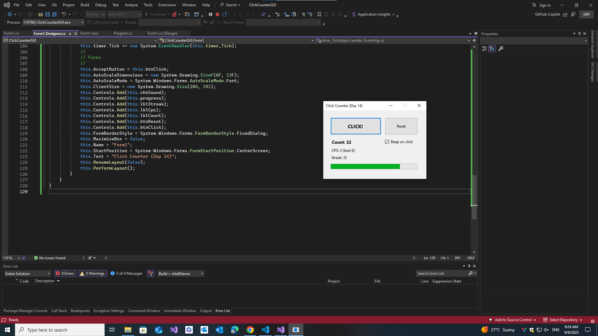

# 🖱️ Click Counter GUI (C# WinForms App)

This is Day 14 of my 30-Day C# Project-Based Learning Plan.
It’s a fun desktop click counter built with Windows Forms, where you can track clicks, streaks, and clicks-per-second (CPS).
--- 
## 🚀 Features

- Click Button → Increases count, streak, and fills the progress bar.

- Reset Button → Clears all values.

- CPS Tracker → Shows real-time clicks per second (with best CPS stored in memory).

- Streak Tracker → Resets automatically when idle.

- Progress Bar → Fills with activity, decays when idle.

- Beep Sound → Optional audio feedback when clicking.
--- 

## 🛠️ Tech Stack

- C# 7.3

- .NET Framework / WinForms

- Visual Studio IDE

 ---

 ## 📸 Screenshots

| 🖱️ | 
|--------------|
|  |

---

## 📚 Learning Goals

This project helped me practice:

- Adding controls (Button, Label, CheckBox, ProgressBar, Timer)

- Wiring events (Click, CheckedChanged, Tick)

- Using partial classes (Form1.cs and Form1.Designer.cs)

- Working with timers for CPS and idle decay

- Managing app state variables inside a form
